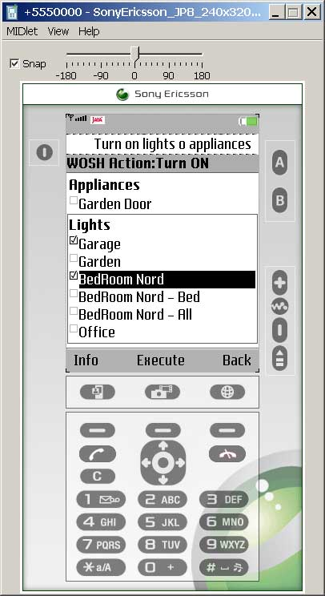
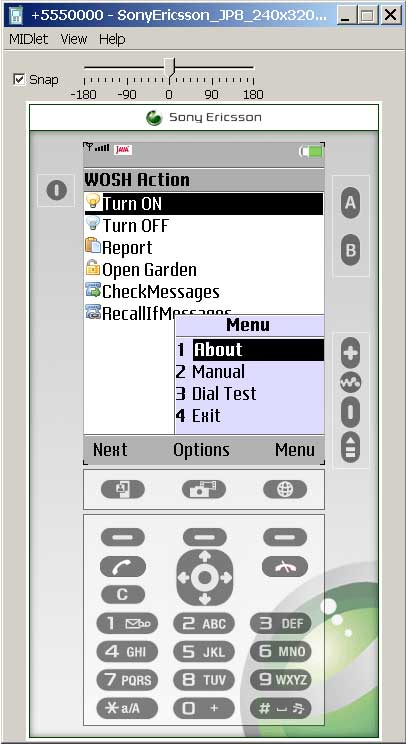
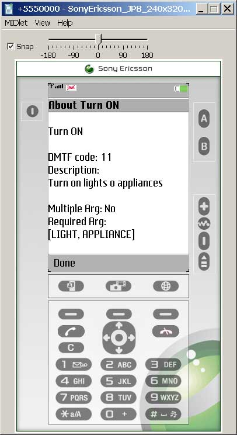
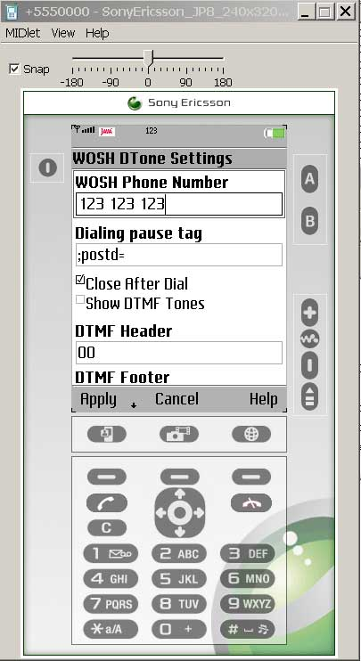

# WOSHDialToneClient - PSTN Remote Control (DTMF) client

Last updated on 2008-12-01. Implemented in JAVA ME (midlet).

A simple JAVA ME midlet which encodes actions (with some parameters) into a DTMF string, it initiates a Call and forward tones to be sent.
It's a client application, there must be a server application (answering machine like) which parses and executes actions.
See server application 'vgettyCtrl'.

## Screenshots

## Requirements
Application was build for a Sony Ericsson phone, but its requirements are few and should work (maybe recompiled)
on any phone respects requirements.
To run (and build indeed) you will need:
 - J2ME Wireless Toolkit 2.2 (or later)   *OR*    Sony Ericsson SDK 2.5.0.2 (or later)

## Build
Copy folder into WTK2 'apps' directory, run WTK toolbar and open project 'WOSHDialToneClient'.
Build the project.
Create package from Project->Package menu.
Run (emulator to try it, indeed calls won't start but you will see the encrypted DTMF string)

## FAQs
The behavior of phone while calling/sending tones is very important for this application,
my phone worked great since it asks me when sending while call
is initiated, so i can wait for the answering machine's greeting message.
